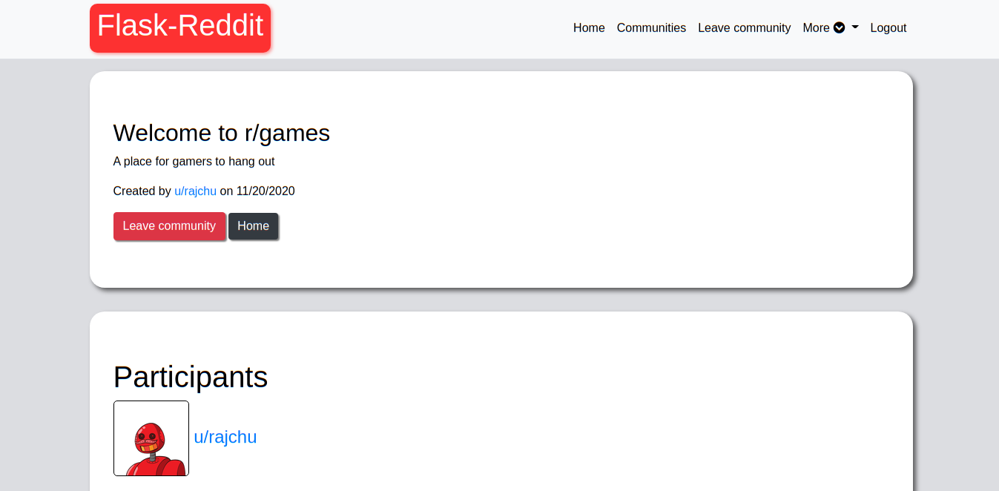
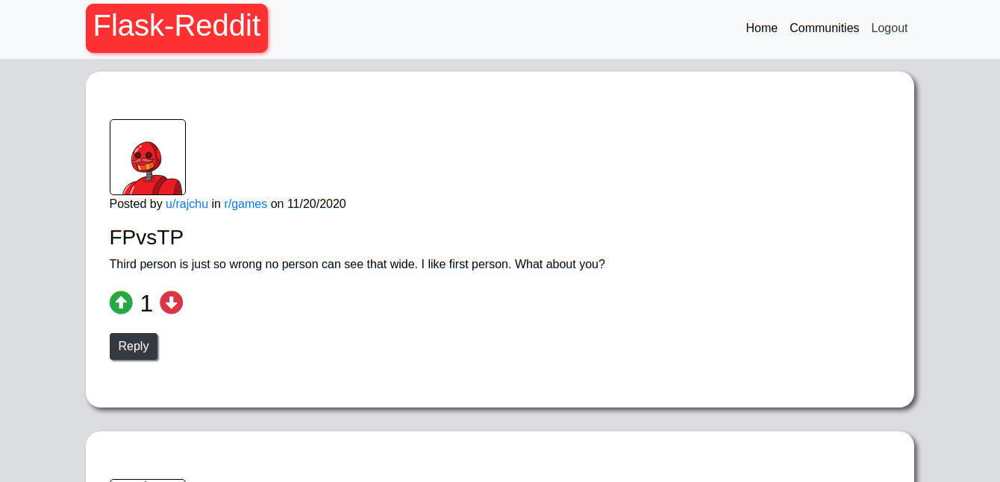
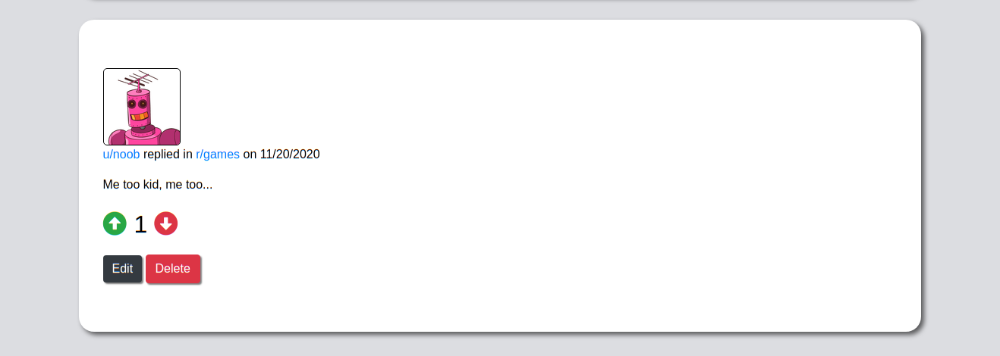

# Flask-Reddit

Try here: https://reddit-flask.herokuapp.com
> A reddit app made with flask.
> Drop a star if you like this project :P
---

## Demo

---

### Table of Contents
- [Description](#description)
- [Technologies](#technologies)
- [How To Use](#how-to-use)
- [Installation](#installation)
- [Reference](#reference)
- [License](#license)

---

## Description
- A reddit like app made with flask
- Token based user authentication via email
- User features(change email, username, password)
- Each user gets a unique profile pic
- Communities can be created by users
- Users can join/leave communities
- Posts in communities have upvote and downvote features
- Reply to post in communities
- Upvote or downvote replies

## Technologies
- Python
- Flask
- HTML
- CSS
- Bootstrap

---

## How To Use
Currently the app is not hosted so you will have to run it yourself.
NOTE: You will require python v3.6+ to run the app locally

---

## Installation
- Clone the repository into your machine using the `git clone` command.
- Once cloned create a virtual environment into your machine with `python -m venv venv`
- Activate the environment with `.\venv\Scripts\activate.bat` on Windows and `source ./venv/bin/activate` on Linux/MacOS
- Once activated install the required libraries with `pip install -r requirements.txt`
- After the installation is done open `env` and copy the content
- Make a new file called `.env` to store environment variables
- Fill in the required details
- To set up the database do `flask db upgrade` to get updated with the current iteration of the database
- After the above steps are completed, run the app locally with `flask run` command
- Open a browser and navigate to `localhost:5000` to view the project

---

## Reference
Used https://gravatar.com for random user profile images.
Gravatar uses email hashes as part of its url to provide images.
Users can change their profile images in gravatar to reflect the changes here.
More info at https://en.gravatar.com/site/implement/

---

## License
MIT License
[Read here](./LICENSE)

[Back To The Top](#flask-reddit)
